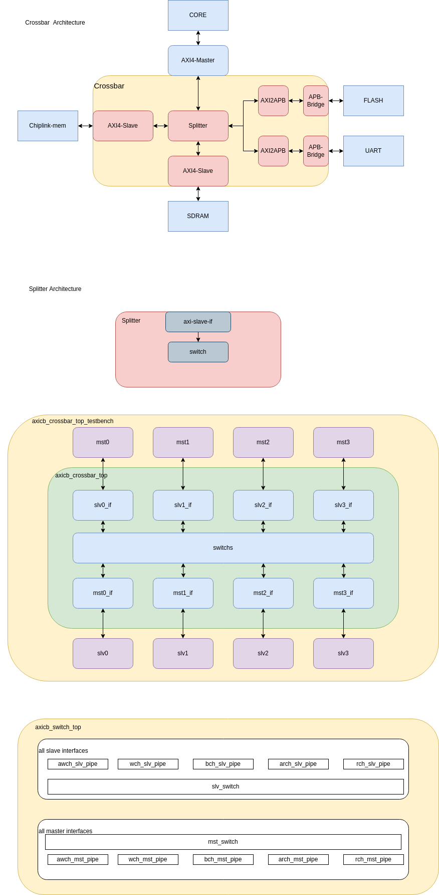

# YSYX-SOC-CROSSBAR  

## introduction-项目介绍   

需求来源: YSYX提供流片服务, 所以需要完整SoC来进行core的功能验证  
soc包含: 时钟+复位+CPU+总部线桥+外设  
目前除了总线桥都是开源的, 总线桥是ARM公司的nic400软件生成的, nic400是商业软件  
为了全开源, 我们需要自己来写一个axi-crossbar  
并且外设逐渐丰富, 需要不断来更新和优化crossbar  

## resource-资源  
github有两个开源的axi-crossbar, 进行简单的拼接就行  
[axi-crossbar](https://github.com/dpretet/axi-crossbar)  
axi-crossbar是一个4master-4slave的总线桥  
[axi](https://github.com/pulp-platform/axi)  
axi包含了很多的axi标准模块, 我们所需要的是axi2apb
两个都是sv语法, 不用害怕, 我看过了, 实际上是verilog加上interface而已  
需要偶尔google下语法, 例如: logic 和 interface是什么(如果你不懂system verilog)  

## picture-逻辑图
  
这是我当时浏览代码画的简单逻辑架构图  
第一个是我对第一版iverilog-soc的预期架构, 具有两个MEM和FLASH, 简单打印的UART外设  
你可能流片过, 我就默认你知道他们相关的地址在ysyx是多少了  
如果你不知道, 请移步到[OSCPU/ysyx-soc](https://github.com/OSCPU/ysyxSoC)  

## knowlege-知识背景  
System-verilog  
AXI4-Full
APB
还需要什么, 貌似没了, 剩下的就是细节了, CDC(clock domain crossing), 异步复位同步回收, AXI2APB(接口转换), 轮询或其他的仲裁算法  

虽然github的axi-corssbar项目4*4的, 但是善良的作者写的是可配置的版本  
所以你可以轻松的把它配置成 1master-4slave, 不过我们不只有高速外设, 还有低速外设SPI和UART, 他们不需要burst, 所以需要用APB协议接口(别慌, 这个接口很简单, 手册只有几页, 我放在doc目录了, 别去ARM官网找辣)  

## task-任务  
看两个仓库的源码, 没办法, 你大概率只写过master, 所以对slave和apb都不太了解  
当然, 肯定有重要的, axi-cross项目更重要一点, 因为比较完整, axi是有很多模块, 你去选你需要的模块拿过来改改就行, 目前我看也就只需要AXI2APB模块.  
当然, 我说的不是都对, 你需要在自己的开发过程中自己添加需要的模块  
AXI-Full目前不支持优先级和原子等特殊模式, 你只需要使用简单的轮询算法(已经实现好了)  

## depository-仓库  
请把你的实现过程放在[iEDA-OSCP](https://github.com/iEDA-Open-Source-Core-Project)组织当中, 你还没进来的话, 请联系lff  
项目名称: isoc-crossbar  
请你记录完整的开发过程, 便于后人使用和维护和升级开发等操作, 也便于你自己bug复现  

## other-其他  
目前想不到其他的了, 886, 有疑问请联系lff  
lff是谁, 不重要, 发送你的疑问给ftppz6@163.com  
lff很懒, 邮箱不怎么经常看, 你可以通过ysyx助教找到他  
